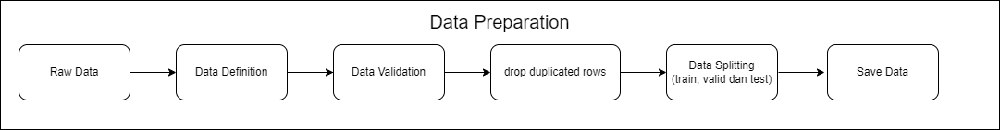

# Craigslist Post Category Prediction

## Business Problem

In the ever-expanding realm of online classifieds, the Craigslist Post Category Prediction project is dedicated to foreseeing the category assignment for every post published on the Craigslist platform. The primary objective is to navigate the challenge of accurately categorizing each post, ensuring that it seamlessly aligns with the essence of its content.

The significance lies in the precision of categorization; it's pivotal that each post finds its place in a category that genuinely captures its nature. The ultimate aim is to enhance user experience by providing a system that effectively organizes posts based on their content, making it easier for users to locate and engage with relevant listings. The success of this project is measured by its ability to streamline the categorization process, offering users a seamless and intuitive platform for exploring Craigslist classified ads.

## Business Objective

The primary business objective of the Craigslist Post Category Prediction project is to develop a robust predictive model capable of accurately categorizing each post on the Craigslist classified ads platform. The focal point is to address the challenge of ensuring that every post is assigned to a category that impeccably represents its content. By achieving this objective, the business aims to enhance the efficiency of content organization on the platform, providing users with a more intuitive and user-friendly experience. The ultimate goal is to optimize user satisfaction and engagement by delivering a precise and effective categorization system for Craigslist classified ads.

## Machine Learning Solution

In crafting a machine learning solution for the Craigslist Post Category Prediction, the journey commenced with the exploration of various models, ultimately leading to the identification of the optimal one— a sophisticated deep learning neural network. The program strategically unfolds through a sequence of pivotal steps, with a strong emphasis on data processing and feature engineering.

As a critical prelude, incoming product data undergoes meticulous preparation to align with the classification process. This involves the cleansing of text from special characters, converting letters to lowercase, and eliminating irrelevant words. Subsequently, the extraction of pertinent features from the product text takes place, leveraging techniques such as vectorization (e.g., TF-IDF). This transformative process converts text into numerical representations, facilitating their utilization by the chosen neural network model.

The focal point of prediction within the model is the 'category' column, where each distinct category is mapped to a numerical value. The mapping includes:

- activities -> 0
- appliances -> 1
- artists -> 2
- automotive -> 3
- cell-phones -> 4
- childcare -> 5
- general -> 6
- household-services -> 7
- housing -> 8
- photography -> 9
- real-estate -> 10
- shared -> 11
- temporary -> 12
- therapeutic -> 13
- video-games -> 14
- wanted-housing -> 15

By integrating these components, the machine learning solution endeavors to effectively predict and assign accurate categories to each post on the Craigslist classified ads platform, ensuring a robust and efficient classification system for enhanced user experience and satisfaction.

## Machine Learning Metrics

The `Craigslist Post Category Prediction` system, leveraging a Multi-class Classification model, serves as a robust data analysis tool designed to identify the categories of posts on the Craigslist classified ads platform based on their provided descriptions. This dataset encompasses information from posts on the online platform, with the target variable being the class variable (product category), reflecting the most suitable category for each product. Feature variables are employed to process and predict the most relevant product categories for each post description.

In this context, the primary focus lies on the business metric - `recall`. `Recall` in this scenario prioritizes the model's ability to accurately predict the correct product category over minimizing false predictions. This implies that the model strives to minimize the number of products genuinely belonging to a specific category but predicted as another category (False Negative) while maximizing the number of products correctly predicted into their corresponding categories (True Positive). Although this may reduce the number of products genuinely not belonging to a particular category predicted as such (False Positive), the primary emphasis remains on ensuring that products genuinely belonging to a category are well-detected.

Thus, the NLP model employed in the Craigslist Post Category Prediction task will be optimized to achieve a high recall value. This optimization aims to enhance the accuracy of product classification into the appropriate categories, reducing the likelihood of overlooking or misclassifying products.

## Literature Review

**Multiclass Classification Model Based on the Combination of IndoBERT Embedding and Long Short-Term Memory for Indonesian-language Tweets**

The combination of pre-trained IndoBERT and Long Short-Term Memory (LSTM) yields superior classification results, both on the original and modified datasets. The IndoBERT-LSTM model with optimal hyperparameters (batch size 16, learning rate 2e-5, and average pooling) achieves an F1-score of 98.90% on the original dataset and 92.83% on the modified dataset. The performance improvement of IndoBERT-LSTM over fine-tuned IndoBERT is not significantly pronounced (Iskandar Zulkarnain Maulana Putra et al., 2022).

**Multi-Class Text Classification of Uzbek News Articles using Machine Learning**

In this study, multiclass text classification is applied to texts written in the Uzbek language, specifically news articles from ten categories selected from the Uzbek online news edition "Daryo." Six different machine learning algorithms—Support Vector Machine (SVM), Decision Tree (DTC), Random Forest (RF), Logistic Regression (LR), and Naïve Bayes Multinomial (MNB)—are employed for multiclass text classification. TF-IDF algorithm and n-gram models at the word and character levels are utilized as feature extraction methods. The hyperparameter determination for text classification involves 5-fold cross-validation. Experimental results show the highest accuracy reaching 86.88% (Rabbimov & Kobilov, 2020).

**Building Multiclass Classification Model of Logistic Regression and Decision Tree Using the Chi-Square Test for Variable Selection Method.**

Feature selection using a filter approach indicates that all predictor features depend on the target feature. Independent predictor features include the mother's pre-pregnancy diabetes history (X2), father's blood pressure (X3), father's psychological condition (X8), and drinking water quality (X10). These features serve as inputs to the classification model. The class label distribution in the dataset is imbalanced, with Class 0 dominating around 70% of Class 0 examples, while there are only 0.33% or 3 out of 900 Class 1 examples. This class label distribution imbalance can affect the acquisition of a better classification model. The Decision Tree model outperforms the Logistic Regression model. Performance metrics, including Accuracy, precision, recall, and F1-score, are 90%, 89%, 90%, and 89%, respectively, for Logistic Regression compared to 91%, 90%, 91%, and 90% for the Decision Tree model. Additionally, the Decision Tree model can demonstrate the importance of features in the separation process during model construction (Nugroho et al., 2022).

## End-to-End Machine Learning Process

The process will encompass data preparation, Exploratory Data Analysis (EDA), Data Preprocessing, Data Modeling, and culminate in a Machine Learning Service using APIs. The entire system will be integrated into a Streamlit application with Docker for containerization, and the deployment will be facilitated through the Streamlit Share server.

### Data Preparation

**Data Preparation Architecture Diagram**


The data preparation process begins with reading raw data, followed by the definition of columns to be processed. This includes data validation, specifically checking data types, identifying duplicate data, and splitting the data into training, validation, and test sets. Finally, the processed data is saved before proceeding to the data preprocessing stage.

#### Dataset Definition

The data used in this analysis includes information about various services, community activities, and properties advertised on the Craigslist e-commerce platform. The dataset contains information from sixteen different cities. Here is a summary of the dataset:

Data Source: Craigslist

The dataset consists of 20,217 rows with four main columns:

1. **city**: This column includes the name of the city where the advertisement is posted.
2. **category**: This column contains the category or classification of the advertisement, reflecting the type of service, item, or property offered.
3. **section**: This column indicates the section of the Craigslist platform where the advertisement is posted, such as services, community, housing, or for-sale.
4. **heading**: This column contains the title or a brief description of the advertisement, providing an overview of the services, items, or properties offered.

Subsequently, we can perform further analysis related to this information to understand trends and patterns on the Craigslist platform.

### Exploratory Data Analysis (EDA)

**Exploratory Data Analysis (EDA) Architecture Diagram**


Next is the Exploratory Data Analysis (EDA) phase. In this stage, exploration of the data is conducted to gain a deeper understanding. The process includes several steps. Firstly, Basic Text Exploration is performed, such as finding the "heading" with the longest and shortest names, examining products with titles containing specific characteristics, searching for rows containing punctuation or special characters, and finding rows with multiple spaces in the title column. Secondly, Data Proportion analysis is carried out by checking the proportion of data in terms of both the count and percentage of target labels. Thirdly, Text Representation involves representing words in text data. Lastly, a WordCloud is generated to visualize word frequency.

### Data Preprocessing

**Data Preprocessing Architecture**


Moving on to the Data Preprocessing stage, the initial step after reading the data prepared in the Data Preparation phase is the execution of post-EDA (Mandatory from EDA) actions. This includes operations such as removing special characters, converting text to lowercase, removing stopwords, and joining the words with a single space. Following this, the data is transformed using TFIDF to assign weights to unique and important words in a document, differentiating one document from another. Additionally, label encoding is applied to the target data with the following mapping: activities -> 0, appliances -> 1, artists -> 2, automotive -> 3, cell-phones -> 4, childcare -> 5, general -> 6, household-services -> 7, housing -> 8, photography -> 9, real-estate -> 10, shared -> 11, temporary -> 12, therapeutic -> 13, video-games -> 14, wanted-housing -> 15. After completing these processes, the data is saved.

### Data Modeling

**Data Modeling Architecture**


Once the data from the preprocessing stage is saved, it is loaded into the data modeling phase. Subsequently, the data undergoes the modeling process with experiments using various models such as extratrees, xgboost, gradient boosting, SVC, logistic regression, lightgbm, and deep learning. However, the best results, with the optimal evaluation metric values, are obtained using the deep learning model, achieving a Test recall of 0.86.

## **Neural Network Architecture:**
The neural network is named `AdvancedNN`, designed for a classification problem. It consists of an input layer, a hidden layer with 256 neurons using the ReLU activation function, a dropout layer for regularization, and an output layer. The model's architecture is crucial in capturing complex patterns in the input data.

**Model Initialization and Optimization:**
The model is initialized with the specified architecture. The chosen loss function is CrossEntropyLoss, suitable for multi-class classification tasks. The Adam optimizer is used to update the model parameters, and a learning rate of 0.001 is set. Additionally, a learning rate scheduler (ReduceLROnPlateau) is employed to adjust the learning rate dynamically during training based on the model's performance on the validation set.

**Training Process:**
The training process involves iterating through the dataset for a specified number of epochs (50 in this case). During each epoch, the model is trained on the training dataset using backpropagation to minimize the defined loss. The Adam optimizer updates the model's parameters. The training loop also includes a validation step to assess the model's performance on a separate validation dataset.

**Early Stopping:**
To prevent overfitting, an early stopping mechanism is implemented. The validation loss is monitored during training, and if no improvement is observed for a predefined number of epochs (5 in this case), the training is halted early. The best-performing model is saved, ensuring that the model with the lowest validation loss is retained.

**Theoretical Explanation:**
- **Neural Network Architecture:** The neural network architecture follows a standard feedforward design. The ReLU activation function introduces non-linearity to capture complex relationships within the data. The dropout layer helps prevent overfitting by randomly setting a fraction of input units to zero during training.
  
- **Loss Function and Optimization:** CrossEntropyLoss is commonly used for multi-class classification as it measures the dissimilarity between predicted and actual class distributions. The Adam optimizer efficiently adjusts the model's weights to minimize this loss.

- **Training Loop:** The model is trained iteratively on batches of data. The learning rate scheduler adjusts the learning rate based on the model's performance on the validation set, allowing for better convergence.

- **Early Stopping:** Early stopping is a regularization technique that halts training when the model's performance on the validation set ceases to improve. This prevents the model from becoming overly specialized to the training data and enhances generalization to unseen data.

In summary, the provided code implements a robust training framework for an ANN, incorporating architectural choices, optimization strategies, and regularization techniques to achieve accurate and generalizable results.

**Classification Report**


## Machine Learning Services Architecture


- The machine learning service process begins with user input, where the provided data is converted into a Pandas dataframe. The input data undergoes a data defense process to ensure compatibility with the pre-trained model. Subsequently, special characters are removed, and the text is converted to lowercase. Stopwords are then removed, and the remaining words are joined with a single space. The cleansed data undergoes transformation using TFIDF, and finally, predictions are made using the pre-trained model saved during the data modeling phase.

- During the prediction phase, users input data through the Streamlit web interface, serving as the front end of the application. Upon the user's click on "Predict," the data is sent as a request to the back end. The back end processes the request and responds with the prediction results to the user.

- This architecture ensures a seamless interaction between the user interface, data preprocessing, and model prediction, providing an end-to-end machine learning service for efficient and user-friendly predictions. The API framework employed in the Machine Learning Service process is FASTAPI, and the front end utilizes Streamlit.

- Following the various processes and saving the model, the next step involves deployment using API and Streamlit. The image below provides an example of accessing ML Services through FASTAPI Swagger UI.

Here is an example of input data used to access the API:

**Prediction using API with FASTAPI**


- This demonstrates the seamless interaction between the user interface, data preprocessing, model prediction, and the API, providing a user-friendly and accessible method for making predictions. To enhance user-friendliness and provide a more powerful interface, users are presented with a simple application built using Streamlit services. Here's an example of how it can be utilized.

**Prediction using provided form**


**Prediction using JSON file**


## Setting Up "Craigslist Post Category Prediction" with Docker

To set up the "Craigslist Post Category Prediction" using Docker, follow these steps:

1. Ensure that you have cloned the repository for this program.
2. Install a virtual environment.
3. Activate the created virtual environment.
4. Install the required packages listed in `requirements.txt` by executing:
   ```
   pip install -r requirements.txt
   ```
5. Make sure Docker is activated and that you are logged in.
6. Run the following script in the terminal with the activated virtual environment:
   ```
   docker compose up -d --build
   ```
7. The "Craigslist Post Category Prediction" Machine Learning Service is now ready for use.
8. Access the API documentation at [http://localhost:8080/docs](http://localhost:8080/docs) and the UI Front End (Streamlit) at [http://localhost:8501](http://localhost:8501).

### Docker Service

The following are the results of inputting the service into a Docker container:


The following are the results of inputting the service into:


## Conclusion

After thorough experimentation, the deep learning neural network emerged as the top-performing model, achieving an impressive recall of 0.86. Notably, the satisfactory results were attained without the need for data augmentation or balancing.

The Craigslist Post Category Prediction project embodies a comprehensive end-to-end machine learning solution, encompassing vital stages such as data preparation, exploratory data analysis, data preprocessing, data modeling, and machine learning services. The implementation strategically employs a deep learning neural network to predict and categorize posts on the Craigslist platform, placing a strong emphasis on achieving precision in categorization.

The selected model is fine-tuned to optimize for high recall, ensuring accurate detection of products genuinely belonging to specific categories. The neural network architecture, loss function, optimization strategy, training loop, and early stopping mechanism are meticulously crafted to yield accurate and generalizable results.

The integration of machine learning services through API and Streamlit provides users with a seamless and user-friendly interface for inputting data and receiving predictions effortlessly. Furthermore, the Dockerization of services using Docker Compose facilitates straightforward deployment and scalability.

In essence, the Craigslist Post Category Prediction project serves as a testament to the transformative power of machine learning in enhancing user experience. It establishes an efficient and intuitive system for organizing and categorizing classified ads on the Craigslist platform.

## Further Research

1. **Exploration with Pre-trained Models:**
   Conducting further exploration using advanced pre-trained models such as BERT, GPT, and others.
   
3. **Evaluation and Application of Data Balancing Techniques:**
   Assessing and implementing data balancing techniques like oversampling or undersampling to address class imbalances.

5. **Collaboration with Domain Experts:**
   Involving collaboration with domain experts and stakeholders to ensure the model adds value in relevant contexts.

These proposed steps aim to enhance the model's performance, explore advanced methodologies, and ensure applicability in real-world scenarios through collaborative efforts.

## References

- [Multi-Class Classification in Python Example](https://www.projectpro.io/article/multi-class-classification-python-example/547?source=post_page-----81975d03e4a3--------------------------------)
- [Comprehensive Guide to MultiClass Classification with Scikit-Learn](https://towardsdatascience.com/comprehensive-guide-to-multiclass-classification-with-sklearn-127cc500f362?source=post_page-----81975d03e4a3--------------------------------)
- [Binary MultiClass Classification using Scikit-Learn](https://www.kaggle.com/code/satishgunjal/binary-multiclass-classification-using-sklearn?source=post_page-----81975d03e4a3--------------------------------#Train-and-Evaluate-a-Binary-Classification-Model)
- [Understanding Multi-Class Classification](https://builtin.com/machine-learning/multiclass-classification)
- Iskandar Zulkarnain Maulana Putra, T., Farhan Bukhori, A., Ilmu Pengetahuan Alam, dan, & Gadjah Mada, U. (2022). [Model Klasifikasi Berbasis Multiclass Classification dengan Kombinasi Indobert Embedding dan Long Short-Term Memory untuk Tweet Berbahasa Indonesia](https://doi.org/10.35912/jisted.v1i1.1509) (Classification Model Based on Multiclass Classification with a Combination of Indobert Embedding and Long Short-Term Memory for Indonesian-language Tweets). *Jurnal Ilmu Siber Dan Teknologi Digital (JISTED)*, 1(1), 1–28.
- Nugroho, W. H., Handoyo, S., Akri, Y. J., & Sulistyono, A. D. (2022). [Building Multiclass Classification Model of Logistic Regression and Decision Tree Using the Chi-Square Test for Variable Selection Method](https://doi.org/10.55463/issn.1674-2974.49.4.17). *Journal of Hunan University Natural Sciences*, 49(4), 172–181.
- Rabbimov, I. M., & Kobilov, S. S. (2020). [Multi-Class Text Classification of Uzbek News Articles using Machine Learning](https://doi.org/10.1088/1742-6596/1546/1/012097). *Journal of Physics: Conference Series*, 1546(1).